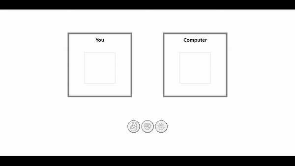

## 가위 바위 보 !

<br>

### 📝 설명

---

컴퓨터를 상대로 가위바위보 게임을 한다.

<br>

<table>
<tr>
      <td>
      
      </td>
</tr>
</table>

<br>

### 📌 주요 기능

---

- <b>컴퓨터의 선택값을 랜덤으로 생성하고 유저의 선택값과 비교하여 승패 결정</b>

<br>

```JavaScript
const choice = {
  rock: {
    name: "Rock",
    img: "src/assets/Rock.png",
  },
  paper: {
    name: "Paper",
    img: "src/assets/Paper.png",
  },
  scissor: {
    name: "Scissor",
    img: "src/assets/Scissor.png",
  },
};

const randomChoice = () => {
    let itemArray = Object.keys(choice);
    let randomItem = Math.floor(Math.random() * itemArray.length);
    let final = itemArray[randomItem];
    return choice[final];
  };

    const judgement = (user, computer) => {
    if (user.name === computer.name) {
      return "Draw";
    } else if (user.name === "Rock")
      return computer.name === "Scissor" ? "Win" : "Lose";
    else if (user.name === "Paper")
      return computer.name === "Rock" ? "Win" : "Lose";
    else if (user.name === "Scissor")
      return computer.name === "Paper" ? "Win" : "Lose";
  };
```

<br>

### 🛠️ 개선 사항

---

- 의미가 비슷한 변수명 수정 필요

<br>
